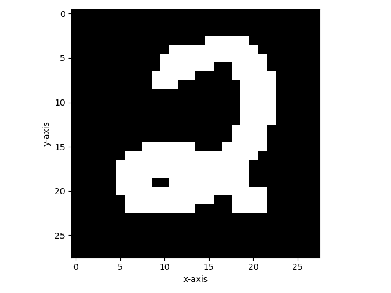
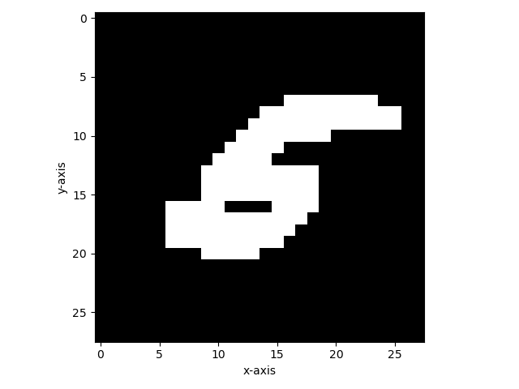

## **Package Requirements:**

`Python v3, numpy, scipy, sklearn, matplotlib, seaborn`

## &quot;**Information Theory: An Analysis of Supervised Learning&quot;**

In this project, we&#39;ll analyze an example of supervised learning, specifically the MNIST data set, using information theory tools such as entropy and mutual information. We&#39;ll start by binarizing the data set and then plotting a heatmap of each digit summed over the training data set. Next, we&#39;ll calculate the mutual information between each pixel and its class label. Finally, we&#39;ll use the pixels with the highest mutual information and calculate their prediction ability on the dataset.

### 1) &quot; **Importing the data set, binarizing and plotting the digits&quot;**

In this project we&#39;ll use a binarized version of the MNIST dataset, which is a large database of handwritten digits that is commonly used for training various image processing systems.

 we&#39;ll import the dataset and binarize it using sklearn&#39;s function:

> mnist = fetch\_openml(&#39;mnist\_784&#39;, cache=False)
> 
> bin_mnist_data = binarize(mnist.data)
> 
> bin_mnist_label = mnist.target.astype(np.int)

Now, we have both the training set and label set.

Each digit has a vector of size 784 and we&#39;ll reshape it to a 28\*28 square to plot the digits. Labels are digits from 0 to 9.
 We&#39;ll select 10,000 images from the training set and another 10,000 from the test set.

By using the plot\_binarized\_digit function we&#39;ll plot the 10th batch of the training set for a demonstration of binarization:

 By adding up all vectors of each digit we&#39;ll make a digit pixel heatmap to see which pixels most represent the digit:

As expected, the heatmap represents the optimal shape of each digit.

### 2) &quot; **Information Theory Tools Analysis&quot;**

We&#39;ll start by calculating the probability distribution of the class labels:

`prob_Y = np.unique(bin_mnist_label, return_counts=True)[1] / bin_mnist_label.shape[0]
`
And we&#39;ll calculate the entropy of probability mass function p ,H(x) = -∑ p \* log2(p) :

> def entropy(vector\_prob):
> 
> if vector\_prob.ndim \> 1:
> 
> \# to account for 2d probability vector
> entropy = np.sum(-np.multiply(vector\_prob, np.ma.log2(vector\_prob)), axis=1)
> entropy = np.ma.fix\_invalid(entropy, fill\_value=0)
> 
> return np.array(entropy)
> 
> else:
> 
> return -np.sum([np.multiply(p, np.ma.log2(p)) for p in vector\_prob])

The entropy for the class labels is 3.318 bits being close to the entropy of a uniform distribution , which is log2(10) = 3.321.

Now, we could estimate the mutual information of each pixel and the class label. This would result in knowing which pixels represent the class label better. The mutual information, have been implemented by the following formula 

`I(X,Y) = H(Y) – H(Y|X)`

Each pixel, either represent its class label or not, thus we calculate P(Y|X=0) and P(Y|X=1) .

The function P\_Y\_given\_X calculates this probability by counting the times each pixel has correctly predicted the label for all the digits.
 Finally, the mutual information is calculated by :
 
`I(X|Y) = H(Y) – H(Y|X=0) * P(X=0) - H(Y|X=1) * P(X=1)`

For I(X,Y), min=0, max=0.336, mean=0.089, and median=0.06.
 This shows some pixels have no mutual information with the class while the best ones have a mutual information of 0.336.

The plot for the mutual information of each digit and the labels is the following figure:

Also, the prediction accuracy of each pixel on the training data is calculated by choosing each pixel and looking for its correct prediction (both true positives and true negatives) on the target set divided by the total number of the images in the selected data set. The pixels with high prediction accuracy have a high concentration in the middle of the image due to the difference between different digits in this area. The plot is the following figure:

To compare pixel accuracy and pixel mutual information, we differentiate the pixel accuracy plot and the mutual information plot (both normalized and not normalized). We could see how well mutual information represents prediction accuracy since the two plots are nearly identical with small areas of difference. As seen in the next plot there are only some areas in the top center and left bottom corner that have a high MI but low accuracy. However, it needs to be mentioned that they are still pixels with low mutual information that could predict the labels well, and mutual information is only one parameter for prediction accuracy of pixels. Later on, we&#39;ll discuss this in full detail by only choosing the pixels with highest mutual information and predicting the image only using them.

### 3) &quot; **Prediction Power of Mutual Information in Supervised Learning&quot;**

In the previous section, the mutual information of pixels and the pixel accuracy has been analyzed. In this section, we&#39;ll try to directly test the predictive power of pixels with high mutual information on the labels using the test data.

First, we&#39;ll descendingly sort the pixels based on their mutual information with the class label. Next, we&#39;ll select the top n pixels in the range of 1 to 80 and calculate each batch of selected pixels&#39; mutual information(joint distribution of them) with the class labels. The plot is the following:

According to the plot, after 30 pixels the maximum entropy is reached which is almost equal to the entropy of the class label.

Finally. we&#39;ll only use the top-n pixels with the highest mutual information with the class in the previous part, to predict the class labels. Since these top-n pixels have a high mutual information, they could provide a pattern to classify the images.

For a range of n from 1 to 80, we&#39;ll construct a classifier which consists only these n pixels. Then, we use this classifier on the test data set and if we find a pattern including only these pixels, we have successfully predicted the label. The plot of the prediction accuracy for the forementioned n pixels is the following:

As seen in the plot accuracy increases from the single pixel accuracy at 0.21 until we reach a maximum accuracy of 0.525 and then it drops to zero, significantly below the single pixel accuracy. The analysis is that there is a limit to finding patterns with high mutual information that fully predict the labels. This is because there are pixels with low mutual information which are used by the network, therefore not present in our selected pixels. While the maximum prediction accuracy is not considered a high value, it still shows the significant prediction value of mutual information between data and labels.

In conclusion, mutual information is a good tool to understand how neural networks work under the hood. This is a starting point to further discover what the neural network is doing to predict the data. Further, using information theory tools to evaluate the performance of deep neural networks is explored in the &quot;Opening the Black Box of Deep Neural Networks via Information&quot; paper by Tishby. He attempts to build a comprehensive theory, namely information bottle neck theory, to find out the relation between mutual information and DNNs. Briefly, the theory is about how compressing the useful information in the data is represented by the mutual information between the data and the middle layers of the network.

## Remarks for PCBS:

1. The project has been coded in a Jupyter notebook for easier debugging due to the long run time of each section. But I have finally decided to put all of my code into a singly python file to conform to the rules and to have the same structure as the other students. The README.MD will walk you through the project step by step. While the python file creates the results and figures at once, all of them will be saved in the same directory.
2. Some variables in the functions shadow names from the outerscope, while the PEP guide discourages this, it was due to readabilty.

## References

1. Studied the workflow of training a network on MNIST in the following website:
	[https://machinelearningmastery.com/how-to-develop-a-convolutional-neural-network-from-scratch-for-mnist-handwritten-digit-classification/](https://machinelearningmastery.com/how-to-develop-a-convolutional-neural-network-from-scratch-for-mnist-handwritten-digit-classification/)

2. A cool visualized neural net for handwritten digit recognition in Javascript that I experimented with.
[http://myselph.de/neuralNet.html](http://myselph.de/neuralNet.html)

3. Studied basic information theory concepts and information bottle neck from Tishby&#39;s papers &quot;Opening the Black Box of Deep Neural Networks via Information&quot; and &quot;The information bottleneck&quot;.

   [1] Tishby, N., Pereira, F. C., &amp; Bialek, W. (2000). The information bottleneck method. _arXiv preprint physics/0004057_.

   [2] Shwartz-Ziv, R., &amp; Tishby, N. (2017). Opening the black box of deep neural networks via information. _arXiv preprint arXiv:1703.00810_.

1. PEP 8 -- Style Guide for Python Code
[https://www.python.org/dev/peps/pep-0008/](https://www.python.org/dev/peps/pep-0008/)

## TODO

1. The probability functions like the conditional probability(P\_Y\_given\_x) are not reusable since they only work in the dimensions of this project.
2. Figures could be done by plotly which offers better tools for analysis.
3. The figures are all in the same path of the main project while they should be saved in dedicated folders. This is due to various combability issues with how Jupyter Notebook and python3 handle files and issues with running the project on another device for testing.
4. The entropy function runtime could be improved by using nump/math entropy function which seems to have the fastest runtime (according to [https://stackoverflow.com/a/45091961](https://stackoverflow.com/a/45091961))
5. By using all the MNIST images (limited to 10,000 for this project because of the limited processing power available due to using an old processor), we would be able to acquire more accurate results.
6. This project could be extended to include the information bottle neck methods
